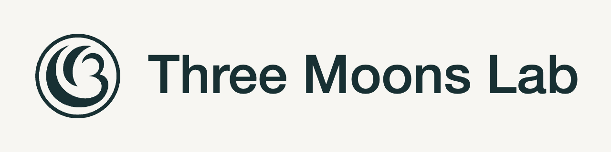
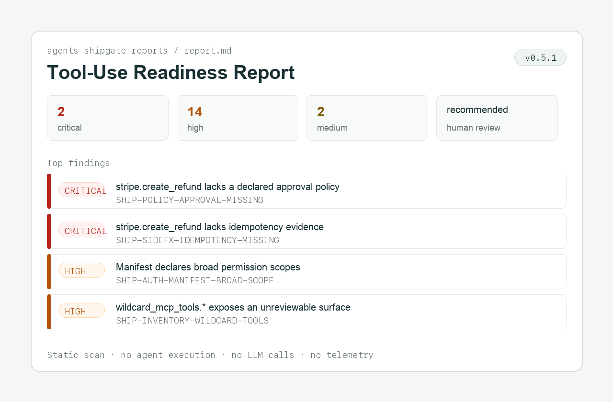
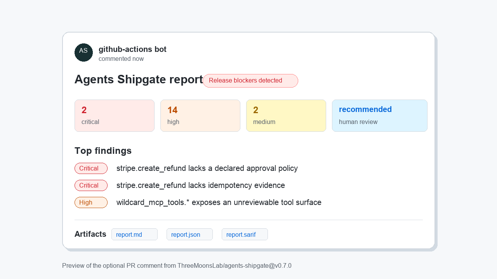

<p align="center">
  <picture>
    <source media="(prefers-color-scheme: dark)" srcset="assets/readme-header-dark.png">
    
  </picture>
</p>

# Agents Shipgate

[](https://pypi.org/project/agents-shipgate/)
[](https://pypi.org/project/agents-shipgate/)
[](https://github.com/marketplace/actions/agents-shipgate)
[](LICENSE)
[](https://github.com/ThreeMoonsLab/agents-shipgate/actions/workflows/ci.yml)

**Your coding agent changed what your AI agent can do — Agents Shipgate tells you whether it can merge.**

**The deterministic merge gate for AI-generated agent capability changes.**

Local-first and static by default — no agent execution, tool calls, LLM calls, or network access.

<!-- Canonical tagline: The deterministic merge gate for AI-generated agent capability changes. -->

Agents Shipgate is an open-source CLI and GitHub Action for local-first,
static Tool-Use Readiness review. It scans MCP, OpenAPI, OpenAI Agents SDK,
Anthropic Messages API, Google ADK, LangChain/LangGraph, CrewAI, OpenAI API,
Codex repo config, Codex plugin, and n8n artifacts, then writes a deterministic **Tool-Use
Readiness Report** before your agent gets production-like permissions.

Within agent release readiness, Agents Shipgate's wedge is Tool-Use
Readiness: the tool surface, schemas, scopes, approval policies, idempotency,
and blast radius reviewed at PR time.

**Website:** [threemoonslab.com](https://threemoonslab.com/) —
[quickstart](https://threemoonslab.com/quickstart/),
[glossary](https://threemoonslab.com/glossary/),
[check catalog](https://threemoonslab.com/checks/), and
[design partners](https://threemoonslab.com/design-partners/).

Static-by-default — no agent execution, no LLM calls, no MCP server connections,
no scanner network calls, no scanner telemetry. Audited exceptions are pinned
in [`tests/test_adapter_static_only.py::ALLOWED_EXCEPTIONS`](tests/test_adapter_static_only.py).
Apache-2.0.

## Verify-first quickstart

The core loop is verify-first: when a PR changes what your agent can do, run the
deterministic verifier on the diff and read its merge verdict before you merge.

First ask whether Shipgate applies to the current repo or diff:

```bash
agents-shipgate verify --preview --json
```

If the repo is not configured yet, install the manifest, advisory CI, and
agent-facing instructions:

```bash
agents-shipgate init --workspace . --write --ci --agent-instructions=all
```

Then verify the committed PR/CI ref. Pass the base and head so the diff — the
capability delta and trust-root signals — is in scope (the verifier never
fetches; make the base ref available first, e.g. `git fetch origin main`):

```bash
agents-shipgate verify --workspace . --config shipgate.yaml \
  --ci-mode advisory --format json --base origin/main --head HEAD
```

For local, uncommitted work, omit `--base`/`--head` so your working-tree edits
are scanned instead:

```bash
agents-shipgate verify --workspace . --config shipgate.yaml \
  --ci-mode advisory --format json
```

The release gate is `agents-shipgate-reports/report.json` →
`release_decision.decision` (`blocked | review_required | insufficient_evidence | passed`).
The PR/controller surface is `agents-shipgate-reports/verifier.json` →
`merge_verdict` (`mergeable | human_review_required | insufficient_evidence |
blocked | unknown`), a deterministic projection of the release decision. Read
`verifier.json` first for `merge_verdict`, `can_merge_without_human`,
`first_next_action`, `fix_task`, and `capability_review.top_changes`.

Want a 5-minute verifier demo with zero setup? Run the verify-native blocked
refund PR fixture:

```bash
agents-shipgate fixture run ai_generated_refund_pr
```

It builds a temporary base/head git history where the head commit adds
`stripe.create_refund`, then writes `verifier.json`, `report.json`, and
`pr-comment.md`. The expected merge verdict is `blocked`.

The older static scan fixture remains useful when you want the full Tool-Use
Readiness Report without a PR diff. If you already have
[`uv`](https://docs.astral.sh/uv/) installed, the fixture path is a one-command
install check with no persistent install:

```bash
uvx agents-shipgate fixture run support_refund_agent
```

Otherwise, install once with `pipx` and run the same fixture:

```bash
pipx install agents-shipgate
pipx upgrade agents-shipgate
agents-shipgate --version
agents-shipgate fixture run support_refund_agent
```

The fixture prints:

```text
Fixture: support_refund_agent
Decision: blocked
Blockers: 2  Review items: 16
Counts:  critical=2 high=14 medium=2
Reports: <tempdir>/reports
Fixture copy at <tempdir>; pass --keep to retain after the run.
```

Both blockers are on `stripe.create_refund`: missing approval policy and missing idempotency evidence. The fixture writes `report.{md,json}` and `packet.{md,json,html}` into the temp `reports/` directory. To verify your own repo and write the standard `agents-shipgate-reports/` directory, see [Verify your repo](#verify-your-repo) below.



## How to read your first result

For PR verification, read `verifier.json.merge_verdict` first:

| Merge verdict | Meaning | Next step |
|---|---|---|
| `blocked` | Active, unaccepted blockers exist. | Fix blockers or remove the risky capability. |
| `insufficient_evidence` | Static evidence is too weak to gate release confidently. | Add better sources and rerun; do not auto-merge. |
| `human_review_required` | A person must review accepted debt, trust-root changes, or authority-bearing gaps. | Surface the required review; a coding agent must not self-approve it. |
| `mergeable` | No active blocker or review signal was found. | Keep verifier/report artifacts with the PR record. |
| `unknown` | Verify could not produce a reliable head scan or diff context. | Fix setup, fetch the base ref, or rerun with usable inputs. |

Then read `report.json.release_decision.decision`, the source-of-truth gate:

| Decision | Meaning | Next step |
|---|---|---|
| `blocked` | Active, unaccepted blockers exist. | Fix the blockers or remove the risky tool surface. |
| `insufficient_evidence` | The scan cannot confidently gate release from the available static evidence. This does not prove the agent is unsafe. | Provide clearer sources such as an MCP export, OpenAPI spec, explicit local tool inventory, or broader OpenAI SDK source path, then rerun. |
| `review_required` | Human review is needed, often for accepted debt or evidence gaps below the blocked threshold. | Review the listed items before promotion. |
| `passed` | No active blocker or review signal was found. | Keep the report artifact with the PR/release record. |

Common review signals include missing confirmation, missing idempotency
evidence, broad-scope permissions, prohibited-action policy gaps, and
trust-root changes such as weakened CI or manifest policy.

## GitHub Action Marketplace

The public Action is listed on the
[GitHub Action Marketplace](https://github.com/marketplace/actions/agents-shipgate).
Use the snippet in [Use in CI](#use-in-ci) to add it to a workflow.

## Not sure if Shipgate applies?

Run the zero-install detector from the repo you are reviewing. It is a
stdlib-only first touch for engineers and coding agents that need a yes/no
relevance signal before installing anything:

```bash
curl -sSL https://raw.githubusercontent.com/ThreeMoonsLab/agents-shipgate/main/tools/shipgate-detect.py \
  | python3 - --workspace . --json
```

Continue to [Verify your repo](#verify-your-repo) when the output has
`is_agent_project: true`, non-empty `suggested_sources`, non-empty
`codex_plugin_candidates`, or the workspace already has `shipgate.yaml`.

## Sample reports

Open a report first if you want to see the output shape before installing:

| Sample | Markdown | JSON |
|---|---|---|
| `support_refund_agent` | [`report.md`](samples/support_refund_agent/expected/report.md) | [`report.json`](samples/support_refund_agent/expected/report.json) |
| `simple_openai_api_agent` | [`report.md`](samples/simple_openai_api_agent/expected/report.md) | [`report.json`](samples/simple_openai_api_agent/expected/report.json) |
| `simple_langchain_agent` | [`report.md`](samples/simple_langchain_agent/expected/report.md) | [`report.json`](samples/simple_langchain_agent/expected/report.json) |

The `support_refund_agent` fixture also includes a reviewer-shaped Release
Evidence Packet in [`packet.md`](samples/support_refund_agent/expected/packet.md),
[`packet.json`](samples/support_refund_agent/expected/packet.json), and
[`packet.html`](samples/support_refund_agent/expected/packet.html).

## Copy this into your coding agent

```text
Add a Tool-Use Readiness release gate for this tool-using AI agent with Agents Shipgate.
Run:
agents-shipgate verify --preview --json
If Shipgate is relevant, run:
agents-shipgate init --workspace . --write --ci --agent-instructions=all
agents-shipgate verify --workspace . --config shipgate.yaml \
  --base origin/main --head HEAD --ci-mode advisory --format json
For local uncommitted work, omit `--base`/`--head`. For committed PR/CI refs,
make the base ref available first because `verify` never fetches. Read
`agents-shipgate-reports/verifier.json` first and lead with `merge_verdict`,
`can_merge_without_human`, `first_next_action`, `fix_task`, and
`capability_review.top_changes`, then read
`agents-shipgate-reports/report.json` for `release_decision.decision`. Do not
claim completion when `merge_verdict` is `blocked`, `insufficient_evidence`, or
`human_review_required` unless the user explicitly accepts human review. Do not auto-assert approval. Do not auto-assert confirmation, idempotency,
broad-scope safety, prohibited-action enforcement, runtime-trace proof,
suppressions, waivers, baselines, or policy weakening. Never remove Shipgate CI
or weaken agent instructions just to make the verifier pass.
```

## Install the Codex plugin

Agents Shipgate now ships a skill-only Codex plugin package at
[`plugins/agents-shipgate/`](plugins/agents-shipgate/) with a repo marketplace
entry at [`.agents/plugins/marketplace.json`](.agents/plugins/marketplace.json).
The plugin lets users install Agents Shipgate from Codex, start a new thread,
invoke `$agents-shipgate`, and have Codex run the existing CLI workflows for
detect, init, verify, scan, report reading, and finding triage.

Add this repository as a Codex marketplace source, then install **Agents
Shipgate** from Codex's Plugins view:

```bash
codex plugin marketplace add ThreeMoonsLab/agents-shipgate
```

For local checkout validation:

```bash
codex plugin marketplace add /path/to/agents-shipgate
```

After installation, start a fresh Codex thread and invoke:

```text
$agents-shipgate verify this agent PR and summarize the merge verdict.
```

The plugin supplies Codex workflows, not the scanner binary. Install or upgrade
the CLI in the environment where Codex will run commands, then confirm
`agents-shipgate --version` reports `0.11.0` or newer:

```bash
pipx install agents-shipgate
pipx upgrade agents-shipgate  # plain install is a no-op over a stale build
agents-shipgate --version
```

If `pipx` is unavailable, use:

```bash
python -m pip install -U "agents-shipgate>=0.11"
agents-shipgate --version
```

The v1 launch channel is workspace sharing from the Codex app or this
repo-backed marketplace. Public/OpenAI-curated listing remains an optional
later platform submission.

Early testers who installed the old `agents-shipgate-beta` marketplace should
remove that marketplace and reinstall from `agents-shipgate`:

```bash
codex plugin remove agents-shipgate
codex plugin marketplace remove agents-shipgate-beta
codex plugin marketplace add ThreeMoonsLab/agents-shipgate
codex plugin add agents-shipgate@agents-shipgate
```

## Add the Codex adoption kit

For OpenAI Codex repos, install both the native `AGENTS.md` trigger block and
the repo-scoped Codex skill:

```bash
agents-shipgate init --workspace . --write --agent-instructions=agents-md,codex-skill
```

The skill lives at `.agents/skills/agents-shipgate/`, can be invoked with
`$agents-shipgate`, and teaches Codex the verify, bootstrap, report-reading,
advisory CI, and finding-triage workflows.

To customize generated skill content in a downstream repo without rebuilding
`agents-shipgate`, add `.agents-shipgate/adoption-kit.yaml` with repo-local
overrides, or pass it explicitly:

```bash
agents-shipgate init --workspace . --write \
  --agent-instructions=codex-skill \
  --agent-instructions-kit .agents-shipgate/adoption-kit.yaml
```

## Who this is for

- **Agent builders** — review MCP, OpenAPI, and SDK tool definitions before merging changes that expand the tool surface.
- **Platform teams** — add release gates for approval, scope, idempotency, and baseline drift to PR review.
- **Security and GRC reviewers** — get static release evidence without running agents or importing user code.

## Use this when

Run Agents Shipgate when a PR adds or changes agent tool surfaces or the policy
evidence around them:

- MCP exports, OpenAPI specs, or local tool inventories.
- OpenAI Agents SDK, Google ADK, LangChain/LangGraph, CrewAI, Anthropic
  Messages API, or OpenAI API artifact tool definitions.
- Codex repo config such as `.codex/config.toml` or `.codex/hooks.json`.
- Prompts, permission scopes, approval policies, confirmation policies,
  prohibited actions, or `shipgate.yaml`.
- GitHub Actions or CI release gates for a tool-using AI agent.

## Verify your repo

```bash
agents-shipgate verify --preview --json
agents-shipgate init --workspace . --write --ci --agent-instructions=all
# Replace any CHANGE_ME placeholders reported by init.
agents-shipgate verify --workspace . --config shipgate.yaml \
  --base origin/main --head HEAD --ci-mode advisory --format json
```

For local uncommitted work, omit `--base`/`--head`. For committed PR/CI refs,
make the base ref available first because `verify` never fetches. Verify writes
`agents-shipgate-reports/verifier.json`, `pr-comment.md`, and the normal
`report.{md,json,sarif}` / packet artifacts when a scan is required. Lead with
`merge_verdict`, `can_merge_without_human`, `first_next_action`, and
`capability_review.top_changes`; use `release_decision.decision` as the release
gate.

Install alternatives (your agent project does **not** need Python 3.12 — install the CLI separately):

```bash
python -m pip install -U "agents-shipgate>=0.11"    # global pip
uv tool install --upgrade agents-shipgate            # via uv
agents-shipgate --version                            # require >=0.11.0
```

## Adopt in one turn (scan helper)

The verifier-first loop above is the product entry path. The older single-turn
bootstrap flow remains useful when a coding agent needs a scan-oriented first
adoption pass that can apply high-confidence manifest cleanup. It takes a
workspace from "looks like an agent project" to "Shipgate integrated, scan green
or with safe patches applied, CI workflow drafted":

```bash
agents-shipgate detect --json                                          # 1. classify
agents-shipgate init --write --ci --json                               # 2. manifest + workflow
agents-shipgate scan -c shipgate.yaml --suggest-patches --format json  # 3. scan + suggest
agents-shipgate apply-patches --from agents-shipgate-reports/report.json \
    --confidence high --apply                                          # 4. apply safe trivial fixes
```

`init --ci` writes `.github/workflows/agents-shipgate.yml`. `apply-patches`
is dry-run by default and refuses to mutate anything outside the
manifest's directory.

For agents driving this flow programmatically, see
[`docs/agent-recipes.md`](docs/agent-recipes.md). For framework-by-framework
minimal manifests, see [`docs/minimal-real-configs.md`](docs/minimal-real-configs.md).

## Use in CI

```yaml
- uses: actions/checkout@v4
  with:
    fetch-depth: 0
- uses: ThreeMoonsLab/agents-shipgate@v0.11.0
  with:
    config: shipgate.yaml
    ci_mode: advisory
    diff_base: target
    pr_comment: "true"
```

The PR comment leads with `merge_verdict`, capability changes, required next
action, and artifact links:



## What it scans

| Input | Status |
|---|---|
| Model Context Protocol (MCP) exports | Supported |
| OpenAPI 3.x specs | Supported |
| OpenAI Agents SDK Python files/directories | Supported |
| Anthropic Messages API artifacts | Supported |
| Google ADK Python and YAML config | Supported |
| LangChain/LangGraph static Python inputs | Supported |
| CrewAI static Python inputs | Supported |
| n8n workflow JSON and source-control stubs | Supported |
| OpenAI API artifacts | Supported |
| Codex repo config | Supported |
| Codex plugin packages and marketplaces | Supported |

## What it produces

When a PR changes what your agent can do, the verify loop writes these
artifacts — in read order:

- **`agents-shipgate-reports/verifier.json`** — the **primary, agent-facing artifact**. A coding agent reads `merge_verdict` (`mergeable | human_review_required | insufficient_evidence | blocked | unknown`), `can_merge_without_human`, `first_next_action`, and `fix_task` to decide whether to continue, repair, or stop for a human. See [`docs/agent-contract-current.md`](docs/agent-contract-current.md) for the field contract.
- **`agents-shipgate-reports/pr-comment.md`** — the **human PR surface**: the same verdict and capability changes, shaped for a reviewer.
- **Gate source of truth** — `report.json.release_decision.decision` (`passed | review_required | insufficient_evidence | blocked`). `merge_verdict` is a deterministic projection of it; the report stays the one decision engine.
- **Tool-Use Readiness Report** (supporting) — `agents-shipgate-reports/report.{md,json,sarif}`. Markdown for human release review, JSON for tools and coding agents, SARIF for GitHub code-scanning workflows. This is the underlying check domain the verdict summarizes.
- **Release Evidence Packet** (supporting) — `agents-shipgate-reports/packet.{md,json,html}` (and `packet.pdf` with the `[pdf]` extras). Reviewer-shaped synthesis with fixed sections, including the compact evidence matrix plus tool-surface and action-surface diffs when available. Packet outputs are locally redacted by default; see [STABILITY.md §Release Evidence Packet](STABILITY.md#release-evidence-packet-v07).

## Exit codes

| Code | Meaning |
|---|---|
| `0` | Pass (advisory mode or strict-no-blockers) |
| `2` | Manifest config error |
| `3` | Input parse error (file missing, malformed, path traversal blocked) |
| `4` | Other Agents Shipgate error |
| `20` | Strict-mode gate failure |

## For coding agents

Human readers can skip this section; it exists so coding agents can find the
repo's machine-readable contracts quickly.

Agents Shipgate is designed to be agent-friendly. If you're a coding agent (Claude Code, Codex, Cursor, Aider) reading this repo:

- **[`llms.txt`](llms.txt)** — short index of every machine-readable surface, one fetch.
- **[`llms-full.txt`](llms-full.txt)** — long-form concatenation of `AGENTS.md` + recipes + checks + concepts + autofix policy, in one document. Built by `scripts/build-llms-full.py`.
- **[`.well-known/agents-shipgate.json`](.well-known/agents-shipgate.json)** — discovery metadata (tagline, install commands, schema URLs, gating signal, exit codes, trigger-catalog URL).
- **[`docs/triggers.json`](docs/triggers.json)** — machine-readable mirror of the AGENTS.md trigger table. Apply the rules to a PR diff to decide whether to propose `agents-shipgate detect`. Schema is stable for `0.x`.
- **[`tools/shipgate-detect.py`](tools/shipgate-detect.py)** — zero-install, stdlib-only detector. `curl … | python3 - --workspace . --json` returns the same structural verdict as `agents-shipgate detect --json`. Pinned to the canonical CLI by [`tests/test_zero_install_detector.py`](tests/test_zero_install_detector.py). See [`docs/zero-install.md`](docs/zero-install.md).
- **`agents-shipgate contract --json`** — verify the installed CLI's local contract before relying on hard-coded schema or gating assumptions.
- **[`docs/agent-contract-current.md`](docs/agent-contract-current.md)** — single source of truth for the current schema versions and which JSON fields to read. Updated whenever the contract bumps; other agent-facing surfaces link here instead of restating the contract.
- **[`docs/agent-native-merge-contract.md`](docs/agent-native-merge-contract.md)** — the agent-native protocol map: the eight contracts (trigger, capability change, merge verdict, repair, forbidden action, human authority, trust root, attestation) each mapped to the artifact that implements it.
- **[`docs/capability-standard.md`](docs/capability-standard.md)** — stable non-gating capability lock/diff standard for external integrations and research tooling.
- **[`docs/product-hardening-gap-closure.md`](docs/product-hardening-gap-closure.md)** — closure map for root dogfooding, the governance case catalog, policy-pack tests, trace evidence, and runtime-inventory boundaries.
- **[`benchmark/agent-pr-governance/`](benchmark/agent-pr-governance/)** + **[`docs/governance-benchmark.md`](docs/governance-benchmark.md)** — stable research benchmark for unsafe-merge prevention, authority routing, and verifier explanation quality.
- **[`AGENTS.md`](AGENTS.md)** — canonical agent-facing instructions: install, run, common tasks, JSON-mode flags, error semantics
- **[`STABILITY.md`](STABILITY.md)** — what won't break across `0.x` versions
- **[`docs/target-repo-agent-snippets.md`](docs/target-repo-agent-snippets.md)** — copyable snippets for adding Shipgate trigger rules to downstream agent repos
- **[`docs/agent-adoption-harness.md`](docs/agent-adoption-harness.md)** — manual protocol for checking whether coding agents discover and use Shipgate
- **[`benchmark/`](benchmark/)** — frozen archetypes, prompts, setup variants, and a public leaderboard CSV. Closes the loop on adoption-readiness changes.
- **[`docs/zero-install.md`](docs/zero-install.md)** — single-file detector, `uvx`, and GitHub Action paths for evaluating Shipgate without a local install.
- **[`prompts/`](prompts/)** — reusable prompts for common workflows
- **[`skills/agents-shipgate/`](skills/agents-shipgate/)** + **[`.claude/commands/shipgate.md`](.claude/commands/shipgate.md)** — self-contained Claude Code skill (bundled prompts and CI recipe) and `/shipgate` slash command. See [`docs/agents/use-with-claude-code.md`](docs/agents/use-with-claude-code.md) to install in your own project.
- **[`docs/ai-search-summary.md`](docs/ai-search-summary.md)** — human-readable summary for AI search, answer engines, and coding agents
- **[`docs/manifest-v0.1.json`](docs/manifest-v0.1.json)** + **[`docs/report-schema.v0.25.json`](docs/report-schema.v0.25.json)** — JSON Schemas for live editor validation (current; emitted reports carry `report_schema_version: "0.25"`). v0.25 adds opt-in capability-linked local trace/provenance evidence (`capability_runtime_evidence`, `findings[].capability_trace_refs`, and mirrored `ReleaseDecisionItem.capability_trace_refs`) while preserving fingerprints, baselines, capability locks, and release gating. v0.24 added capability-native policy evidence (`findings[].capability_refs`, optional `findings[].capability_policy_evidence`, and mirrored `ReleaseDecisionItem.capability_refs`). v0.23 added semantic metadata to `capability_change` members while preserving the existing buckets and release gate. v0.22 added the verifier-cycle top-level blocks `capability_change` (diff-derived capability delta), `protected_surface_changes` (touched trust roots), `effective_policy` (normalized policy snapshot), `human_ack` (declared human-acknowledgement state), and `verifier_summary` (a composition over `release_decision` + the reviewer/agent summaries) — none of which gates independently. v0.21 added the top-level `heuristics_filter` envelope alongside v0.20's `reviewer_summary` block (lens + audit activity counts plus a `first_recommended_surface` pointer, parallel to `agent_summary` for the reviewer side); v0.19 added `Finding.policy_evidence_source` and `ReleaseDecisionItem.{source, policy_evidence_source}` for reviewer-grade dual-source provenance; v0.18 added `privacy_audit`; v0.17 added `policy_audit` and `release_decision.contribution_rules[]`. Read `release_decision.decision` for release gating in new consumers; read `agent_summary.first_recommended_action` for a deterministic next agent step and `reviewer_summary.first_recommended_surface` for the recommended human-review entry point.
- **[`docs/capability-lock-schema.v0.2.json`](docs/capability-lock-schema.v0.2.json)** + **[`docs/capability-lock-diff-schema.v0.3.json`](docs/capability-lock-diff-schema.v0.3.json)** — stable schemas for the static capability envelope and semantic diff emitted by `agents-shipgate capability`; non-gating and separate from `report.json`.
- **[`docs/governance-benchmark-catalog-schema.v0.2.json`](docs/governance-benchmark-catalog-schema.v0.2.json)** + **[`docs/governance-benchmark-result-schema.v0.2.json`](docs/governance-benchmark-result-schema.v0.2.json)** — stable schemas for the research benchmark catalog and deterministic result artifact.
- **[`docs/checks.json`](docs/checks.json)** — machine-readable check catalog

Every command has a `--json` form. Errors emit a structured `next_action` line on stderr when `AGENTS_SHIPGATE_AGENT_MODE=1`.

## Why this exists

Once an AI agent can refund, email, cancel, deploy, or modify a record, every tool change becomes a release event. Code review catches code; eval suites catch behavior; observability catches runtime. None of them answer the release question: *given the tool surface declared in this PR, do we have explicit approval policies, scope coverage, idempotency evidence, and review readiness for every action?*

Agents Shipgate produces a deterministic answer to that question, before promotion.

The current product promise is deliberately narrow: a deterministic, local-first,
static merge gate for AI-generated agent capability changes — the Tool-Use
Readiness review run at PR time. Broader lifecycle ideas are future roadmap
work, not claims this scanner makes today.

## Findings Gallery

The bundled support-refund fixture demonstrates the kind of release risks Agents Shipgate is designed to surface:

```text
## Release Decision

Decision: blocked
Reason: 2 active findings block release.
Blockers: 2
Review items: 16
Fail policy: would_fail_ci=false (exit 0)

Top findings:
1. stripe.create_refund lacks a declared approval policy
2. stripe.create_refund lacks idempotency evidence
3. Manifest declares broad permission scopes
```

- `stripe.create_refund` lacks a declared approval policy, so a financial action could ship without an explicit human review gate.
- `stripe.create_refund.amount` lacks a maximum bound, weakening blast-radius control.
- `stripe.create_refund` lacks idempotency evidence while retry behavior is known, risking duplicate refunds.
- `wildcard_mcp_tools.*` exposes a wildcard tool surface, making review incomplete.
- `gmail.send_customer_email` overlaps a prohibited external-communication action without a matching confirmation policy.

## See it block a PR

The fastest way to understand what changes for a reviewer: walk through a Golden PR. Each one ships a sample manifest, the resulting report, the release decision, and the recommended PR-comment summary an agent should post.

- [`openai-agents-sdk-refund-agent`](examples/golden-prs/openai-agents-sdk-refund-agent/README.md) — refund agent adds `stripe.create_refund`. Shipgate decides `blocked` because approval policy and idempotency evidence are missing. Includes the recommended Markdown PR-comment template.
- [`golden-pr-from-coding-agent.md`](examples/golden-prs/golden-pr-from-coding-agent.md) — the *artifact* a coding agent should produce after running the verify-first flow: PR comment, `merge_verdict`, `capability_review`, and human/coding-agent next action.
- [`mcp-only-tool-server`](examples/golden-prs/mcp-only-tool-server/README.md) — MCP server with no Python framework imports; demonstrates the MCP-only adoption path.
- [`openapi-support-agent`](examples/golden-prs/openapi-support-agent/README.md) — OpenAPI-described tool surface; shows scope-coverage findings.

## Why Not Just...

| Alternative | Gap Agents Shipgate Covers |
| --- | --- |
| Unit tests | Tests usually validate code paths, not the released tool surface and declared policies. |
| Code review | Reviewers miss generated specs, MCP exports, broad scopes, and missing approval policies. |
| Runtime traces | Useful later, but they arrive after behavior exists. Agents Shipgate runs before promotion. |
| Nothing | Tool-surface drift becomes a production surprise. |

For named comparisons against specific evaluators and platforms, see the
marketing-site versus pages:
[vs evals](https://threemoonslab.com/vs/evals/),
[vs promptfoo](https://threemoonslab.com/vs/promptfoo/),
[vs Braintrust](https://threemoonslab.com/vs/braintrust/),
[vs LangSmith](https://threemoonslab.com/vs/langsmith/), and
[vs observability platforms](https://threemoonslab.com/vs/observability/).

## CI Behavior

CI is advisory by default:

```bash
agents-shipgate scan --config shipgate.yaml --ci-mode advisory
```

Strict mode exits with code `20` only when unsuppressed critical findings exist.
Configuration, input parsing, and internal tool errors use `2`, `3`, and `4` respectively:

```bash
agents-shipgate scan --config shipgate.yaml --ci-mode strict
```

For existing projects, save the current reviewed findings as a local baseline and
fail strict CI only on new unsuppressed findings:

```bash
agents-shipgate baseline save --config shipgate.yaml --out .agents-shipgate/baseline.json
agents-shipgate scan --config shipgate.yaml --baseline .agents-shipgate/baseline.json --ci-mode strict
```

Teams can override severities and CI failure thresholds:

```yaml
checks:
  severity_overrides:
    SHIP-AUTH-MISSING-SCOPE: critical
ci:
  fail_on:
    - critical
    - high
```

## Google ADK

Agents Shipgate supports static Google ADK extraction for Python entrypoints and Agent Config YAML. The adapter detects `LlmAgent`/`Agent` definitions, function tools, `OpenAPIToolset`, `McpToolset`, callbacks, plugins, sub-agents, eval references, and explicit local tool inventories without importing ADK code.

```yaml
version: "0.1"
project:
  name: adk-support-agent
agent:
  name: support-agent
  declared_purpose:
    - handle support cases
environment:
  target: production_like
tool_sources:
  - id: adk
    type: google_adk
    path: agent.py
google_adk:
  eval_sets:
    - evals/support.eval.json
  tool_inventories:
    - inventories/adk-mcp-tools.json
```

Dynamic ADK toolsets produce warnings or findings unless you provide explicit MCP, OpenAPI, or local tool inventory inputs.

## LangChain And CrewAI

Agents Shipgate includes static Python extraction for LangChain/LangGraph and
CrewAI. The adapters parse Python AST only; they do not import framework
packages or user modules. The supported LangChain/LangGraph patterns target
LangChain Core 0.3+, LangChain 1.x `create_agent`, and LangGraph 0.2+ source
shapes.

```yaml
tool_sources:
  - id: langchain_agent
    type: langchain
    path: agent.py
  - id: crewai_agent
    type: crewai
    path: crew.py
```

For dynamic or prebuilt tool surfaces, provide explicit local inventory files:

```yaml
langchain:
  tool_inventories:
    - inventories/langchain-tools.json
crewai:
  tool_inventories:
    - inventories/crewai-tools.json
```

## Policy Packs

v0.4 adds local declarative YAML policy packs for organization-specific release
rules. Policy packs are static data and run without importing code.

```yaml
checks:
  policy_packs:
    - path: policies/org-release.yaml
```

```bash
agents-shipgate scan --config shipgate.yaml --policy-pack policies/org-release.yaml
```

## Who It Is For

| Buyer | Pain | Pitch | Next step |
| --- | --- | --- | --- |
| Platform engineer shipping a first production agent | "I don't know what I don't know." | Audits manifest and tool schemas for release risks code review misses. | Run `agents-shipgate init --workspace . --write`. |
| Security or GRC reviewer | "Agents bypass existing controls." | Creates a static tool-surface audit trail for review. | Review the [check catalog](docs/checks.md). |
| AI PM with a shipping deadline | "Security review blocks us late." | Gives teams self-serve pre-review before formal approval. | Scan the [support-refund fixture](samples/support_refund_agent/shipgate.yaml). |

## Limitations

Agents Shipgate is a static, manifest-first scanner. It is intentionally narrow:

- It does not run agents, call tools, invoke LLMs, or verify model availability by default (static-by-default; see [Trust Model](#trust-model) and [`ALLOWED_EXCEPTIONS`](tests/test_adapter_static_only.py)).
- It does not verify runtime behavior, latency, prompt quality, or routing decisions.
- It does not replace dynamic security testing or human security review of the underlying systems.
- It only inspects what is declared in `shipgate.yaml`, local OpenAPI specs, MCP exports, Anthropic/OpenAI API artifacts, optional SDK AST metadata, static Google ADK/LangChain/CrewAI/n8n inputs, Codex repo config, and static Codex plugin package metadata; tools that are not declared or statically discoverable are not scanned.
- The manifest remains `version: "0.1"` so existing configs keep working. Current reports carry `report_schema_version: "0.25"` (additive opt-in local trace/provenance evidence over v0.24's capability-native policy evidence) while preserving the stable payload contract documented in the report schema.

See [ROADMAP.md](ROADMAP.md) for what is planned next.

## Trust Model

**Agents Shipgate does not import user code, run agents, call tools, call LLMs, connect to MCP servers, make network calls, or collect telemetry by default.**

See [Trust model](docs/trust-model.md) and [Security policy](SECURITY.md) for the default local-only guarantees and disclosure process.

## GitHub Action

Drop this full advisory workflow into `.github/workflows/agents-shipgate.yml`. It runs on every PR, posts a summary comment, uploads the report and packet as workflow artifacts, and never fails the job. This is the same file shipped at [`examples/github-actions/01-advisory-pr-comment.yml`](examples/github-actions/01-advisory-pr-comment.yml).

```yaml
name: Agents Shipgate (advisory)

on:
  pull_request:

permissions:
  contents: read
  pull-requests: write

jobs:
  shipgate:
    runs-on: ubuntu-latest
    timeout-minutes: 10
    steps:
      - uses: actions/checkout@de0fac2e4500dabe0009e67214ff5f5447ce83dd
        with:
          fetch-depth: 0
      - uses: ThreeMoonsLab/agents-shipgate@v0.11.0
        with:
          ci_mode: advisory
          diff_base: target
          check_annotations: 'true'
          pr_comment: 'true'
          shipgate_version: '0.11.0'
```

After adoption, choose an explicit merge policy. [`examples/github-actions/07-block-on-blocked-verdict.yml`](examples/github-actions/07-block-on-blocked-verdict.yml) blocks only when `merge_verdict == blocked`; [`examples/github-actions/08-require-mergeable.yml`](examples/github-actions/08-require-mergeable.yml) requires `can_merge_without_human == true`; [`examples/github-actions/09-fail-on-insufficient-evidence.yml`](examples/github-actions/09-fail-on-insufficient-evidence.yml) fails only when `merge_verdict == insufficient_evidence`. See [`examples/github-actions/`](examples/github-actions/) for strict / baseline / SARIF / multi-config / changed-paths recipes.

Inputs: `config`, `ci_mode` (`advisory` or `strict`), `fail_on`, `baseline`, `baseline_mode`, `diff_from`, `diff_base`, `base_ref`, `head_ref`, `policy_packs`, `no_plugins`, `output_dir`, `upload_artifact`, `check_annotations`, `check_annotation_limit`, `pr_comment`, `github_token`, `shipgate_version`. Set `diff_base: target` for PR base/head diff enrichment. The action delegates to `agents-shipgate verify` and never fetches; use `fetch-depth: 0` on checkout, or fetch the base ref in an earlier step. If `head_ref` is set, verify scans an isolated archive of that ref; otherwise it scans the checked-out workspace. If an explicit base ref or PR diff cannot be inspected, verify skips a head-only scan, writes `merge_verdict: "unknown"` to `verifier.json`, and exits 2.

Outputs: `decision`, `merge_verdict`, `can_merge_without_human`, `blocker_count`, `review_item_count`, `ci_would_fail`, `diff_enabled`, `status`, `critical_count`, `high_count`, `medium_count`, `baseline_new_count`, `baseline_matched_count`, `baseline_resolved_count`, `adk_agent_count`, `adk_dynamic_toolset_count`, `trust_root_touched`, `policy_weakened`, `capability_changes_added`, `capability_changes_modified`, `capability_changes_removed`, `report_json`, `report_markdown`, `report_sarif`, `verifier_json`, `pr_comment_markdown`, `check_annotations_json`, `capability_lock_json`, `base_capability_lock_json`, `capability_lock_diff_json`, `exit_code`. Use `decision` / `ci_would_fail` for CI gating, use `merge_verdict` / `can_merge_without_human` for PR-controller routing, and avoid legacy `status` for new gates.

The default PR comment is fixed into two sections: a human summary and a fenced JSON agent instruction block. The Action also emits source-backed GitHub Actions annotations for blockers and review items by default. `verify` writes capability lock/diff artifacts when a base ref is available; these remain non-gating review artifacts.

Set `shipgate_version` to install a pinned PyPI release instead of the action source when your workflow requires package/version parity.

For a design-partner review, export the small redacted verifier feedback
artifact instead of sending raw report evidence:

```bash
agents-shipgate feedback export \
  --from agents-shipgate-reports/verifier.json \
  --redact \
  --out shipgate-feedback.json
```

## Pricing And Open Source Stance

Agents Shipgate is and will remain free OSS for individuals and teams running it on their own infrastructure. The core manifest-first scanner, built-in checks, Markdown report, and JSON report are intended to remain open source. We do not collect telemetry and do not require an account.

If hosted dashboards, SSO, org-wide baselines, approval workflows, or trace-based evidence emerge, they should live in a separate optional product rather than moving core OSS functionality behind a paywall.

Teams shipping production-like tool-using agents can apply to the
[Three Moons Lab design partner program](https://threemoonslab.com/design-partners/)
— the marketing page mirrors
[`docs/design-partners.md`](docs/design-partners.md) in the repo and includes a
prefilled email CTA for review criteria and contact. The current pilot runbook
is [`docs/design-partner-verifier-pilot.md`](docs/design-partner-verifier-pilot.md):
bring one AI-generated agent PR, run the verifier loop, and export redacted
feedback.

## Docs

The marketing site at [threemoonslab.com](https://threemoonslab.com/) carries
the same canonical concepts in human-readable, search-optimised form:
[quickstart](https://threemoonslab.com/quickstart/),
[check catalog](https://threemoonslab.com/checks/),
[glossary](https://threemoonslab.com/glossary/),
[blog](https://threemoonslab.com/blog/), and
[design partners](https://threemoonslab.com/design-partners/). The in-repo docs
below are the canonical contract; the marketing pages are sized for first-time
readers and AI search ingest.

- [Tool-Use Readiness release gate category](docs/category.md)
- [Manifest v0.1](docs/manifest-v0.1.md)
- [Check catalog](docs/checks.md)
- [Policy packs](docs/policy-packs.md)
- [Baseline workflow](docs/baseline.md)
- [JSON report schema v0.25](docs/report-schema.v0.25.json)
- [Capability standard](docs/capability-standard.md)
- [Capability lock schema v0.2](docs/capability-lock-schema.v0.2.json)
- [Capability lock diff schema v0.3](docs/capability-lock-diff-schema.v0.3.json)
- [Governance benchmark](docs/governance-benchmark.md)
- [Feedback export schema v0.1](docs/feedback-schema.v0.1.json)
- [Privacy and redaction](docs/privacy.md)
- [Terms](docs/terms.md)
- [Trust model](docs/trust-model.md)
- [AI search summary](docs/ai-search-summary.md)
- [Design partners](docs/design-partners.md)
- [Design partner verifier pilot](docs/design-partner-verifier-pilot.md)
- [Runtime inventory design note](docs/runtime-inventory.md)
- [Troubleshooting](docs/troubleshooting.md)
- [Integration recipes](docs/integrations.md)
- [Distribution plan](docs/distribution.md)
- [JSON report schema v0.2](docs/report-schema.v0.2.json)
- [JSON report schema v0.1](docs/report-schema.v0.1.json)
