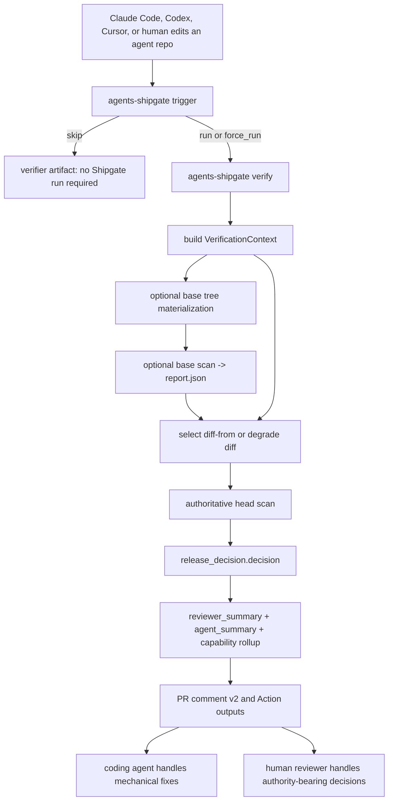

# AI Coding Workflow Verifier Canonical Engineering Guide

Status: canonical engineering direction for the next verifier cycle

Audience: maintainers, contributors, and AI coding agents working on Agents Shipgate

Scope: product direction, architecture constraints, roadmap, and acceptance criteria for making Agents Shipgate the deterministic verifier inside AI coding workflows

## 1. North star

Agents Shipgate is the deterministic merge gate for AI-generated agent capability changes — today delivered as a local-first, static Tool-Use Readiness review. The next product step is not to become a broader scanner. The next step is to make that merge gate the deterministic verifier that must pass when Claude Code, Codex, Cursor, or a human produces an agent-related diff.

North-star sentence:

> When a coding agent changes what an AI agent can do, Agents Shipgate deterministically identifies the capability delta, applies release policy, explains the decision, and tells the coding agent or human reviewer the next safe action.

Keep the canonical tagline:

> The deterministic merge gate for AI-generated agent capability changes.

Add this sentence when the verifier loop ships:

> Built for AI coding workflows: when Claude Code, Codex, Cursor, or a human changes an agent's tool access, Agents Shipgate turns the diff into a deterministic release decision.

The repositioning is a narrowing. Coding agents build and edit. Shipgate verifies the resulting capability change from local static evidence.

## 2. Calibrated repo facts

Roadmap decisions must start from the current codebase, not from the older scanner mental model.

### 2.1 Trigger evaluation already exists

The trigger evaluator is not greenfield work. [`src/agents_shipgate/triggers.py`](../../src/agents_shipgate/triggers.py) already provides:

- `evaluate()` as the canonical module-level evaluator
- argparse `main()`
- `--list-rules`
- `--diff-text`
- git revspec support via `_git_diff_context`
- stdin path reading
- action precedence aligned with [`docs/triggers.json`](../triggers.json)

The remaining work is promotion and UX alignment:

- expose it as `agents-shipgate trigger`
- align flags with the verifier workflow (`--changed-files`, `--diff`, `--base`, `--head`)
- add AGENTS.md <-> triggers.json parity tests
- preserve `python -m agents_shipgate.triggers` as a developer path

This is a small P0 task, not a full milestone.

### 2.2 Summary projections already cover most verifier needs

[`AgentSummary`](../../src/agents_shipgate/schemas/report.py) already answers what an agent should do next. [`ReviewerSummary`](../../src/agents_shipgate/schemas/report.py) already answers what a reviewer should inspect first. Both are deterministic projections and both forbid extra fields.

A new independent `verifier_summary` would create drift risk unless it is explicitly a composition of existing surfaces.

Canonical rule:

- Extend `reviewer_summary` for reviewer-facing capability and trust-root rollups.
- Keep `agent_summary.first_recommended_action` as the agent action surface.
- If `verifier_summary` exists, define it as a composition alias over `release_decision`, `reviewer_summary`, `agent_summary.first_recommended_action`, and trigger context.
- Add a property test that `verifier_summary.verdict == release_decision.decision` for every emitted report.

### 2.3 Diff is report-vs-report today

`scan` accepts `--diff-from PATH`, where the path is a prior `report.json` or compatible baseline. It does not accept git refs directly.

Therefore `verify` is not just a wrapper around `scan`. The hard work is:

1. Resolve git base/head.
2. Materialize or isolate the base tree.
3. Run a base scan when possible.
4. Feed the base report into head scan via `--diff-from`.
5. Degrade safely when base scan is unavailable.

The contract is strict: base scan failure may disable diff enrichment, but it must never weaken the head release gate.

### 2.4 Adapter expansion is not the strategic wedge

Agents Shipgate already covers MCP, OpenAPI, OpenAI Agents SDK, Anthropic Messages API, Google ADK, LangChain/LangGraph, CrewAI, OpenAI API artifacts, Codex plugins, and n8n. New framework adapters remain useful, but they are not the primary next-cycle objective.

The strategic wedge is AI coding workflow verification: trigger, verify orchestration, trust-root protection, capability-legible output, and agent-safe remediation.

### 2.5 Verify checks need diff context

Plain `scan` reads `shipgate.yaml` and declared local sources. It does not know which paths changed in a PR. Any check that reasons about "this PR touched a trust root" needs a separate diff context.

Canonical implementation direction:

- introduce an internal `VerificationContext` built by `verify`
- thread that context into the scan/check pipeline as optional metadata
- emit verify/trust-root findings only when that context is present
- keep plain `scan` behavior unchanged when no verification context exists

This preserves one decision engine while giving trust-root checks the inputs they need. `verify` supplies context; checks emit findings; `release_decision.decision` gates.

## 3. Hard principles

### Principle 1: make capability deltas legible or the gate harder to bypass

Every new verifier-cycle feature must satisfy at least one of these:

- It makes the agent capability delta more legible to a reviewer or controller.
- It makes an attempt to bypass or weaken the release gate detectable and release-gating.

If a feature does neither, do not build it in this cycle.

Precise wording: no static tool can make a target repo literally unmodifiable. The engineering target is that bypass attempts are detected and become release signals.

### Principle 2: one decision engine

`release_decision.decision` is the only release gate.

Every new construct must be one of:

- an input to the existing decision engine, usually a normal `Finding` emitted by a check
- a byte-stable projection of existing report data

Never add a second verdict, safety opinion, or hidden decision path.

Implications:

- Trust-root detection is a check category that emits ordinary findings.
- `verifier_summary` cannot independently derive a verdict.
- PR comments and Action outputs must name `release_decision.decision`.
- `summary.status` remains legacy and must not be used for new gating.

### Principle 3: prompts are not controls

Every agent-facing instruction that says "do not weaken the gate" must have a deterministic check behind it.

Instruction is a request. A check is the contract.

Examples:

- "Do not suppress findings to pass CI" must be backed by waiver and suppression expansion detection.
- "Do not lower severity" must be backed by policy weakening detection.
- "Do not remove Shipgate CI" must be backed by CI gate removal detection.
- "Do not invent approval or idempotency evidence" must be backed by findings that route authority-bearing evidence to a human.

### Principle 4: human authority cannot be synthesized

Coding agents may perform mechanical fixes:

- remove stale manifest entries
- wire existing declared evidence
- add missing static metadata when the repository already supports it
- apply high-confidence safe patches
- fix schema or path mistakes

Coding agents must not invent:

- approval evidence
- confirmation evidence
- idempotency evidence
- prohibited-action justification
- broad-scope justification
- runtime trace evidence
- business-owner acceptance
- human acknowledgement of policy weakening

When a capability change requires authority, the next action must name a human actor.

### Principle 5: keep the static trust boundary

Shipgate must remain:

- local-first
- deterministic
- static by default
- CI-native
- JSON-first for coding agents
- Markdown and PR-comment friendly for human reviewers
- no LLM calls
- no agent execution
- no tool calls
- no MCP server connections
- no scanner network calls
- no telemetry by default

Do not reposition Shipgate as an AI code reviewer, runtime guardrail, eval runner, observability platform, hosted approval system, or agent execution sandbox.

## 4. Canonical workflow architecture



Layer responsibilities:

- `trigger`: decides whether Shipgate should run on the diff. It does not decide safety.
- `scan`: emits findings, report artifacts, and `release_decision.decision`.
- `verify`: orchestrates git refs, trigger evaluation, base scan, head scan, diff enrichment, `VerificationContext`, and verifier-shaped artifacts.
- `reviewer_summary`: reviewer-facing deterministic projection.
- `agent_summary`: coding-agent next action projection.
- PR comment v2: controller-readable summary, not a new decision engine.

### 4.1 Internal verifier context

`VerificationContext` should be the only new cross-cutting input introduced for the verifier cycle.

Recommended shape:

```python
class VerificationContext(BaseModel):
    changed_files: list[str]
    diff_text_available: bool
    trigger_result: dict[str, object]
    base_ref: str | None = None
    head_ref: str | None = None
    base_report_path: str | None = None
    base_scan_status: Literal[
        "not_requested",
        "succeeded",
        "missing_manifest",
        "unsupported_schema",
        "scan_failed",
    ] = "not_requested"
    base_scan_notes: list[str] = Field(default_factory=list)
```

Rules:

- `VerificationContext` is input metadata, not a report verdict.
- It may cause checks to emit findings.
- It may be rendered in `verifier.json` and report notes.
- It must not bypass `release_decision`.
- Absence of `VerificationContext` means plain `scan` behavior.

### 4.2 Public command contracts

`agents-shipgate trigger` should expose the existing evaluator as a stable public command.

Compatibility rules:

- Keep the existing evaluator's `run_shipgate` field for compatibility.
- Add a friendlier alias such as `should_run` only if it is a duplicate of `run_shipgate`.
- Keep `matched_rules`, `dry_run_recommended`, `stop_conditions_fired`, `rationale`, and `schema_version`.
- Preserve `python -m agents_shipgate.triggers` for developers.

`agents-shipgate verify` produces a compact `verifier.json`, but `report.json` remains the authoritative artifact.

`verifier.json` contains:

- trigger result
- base scan status and notes
- path to the head `report.json`
- `release_decision.decision`
- selected `agent_summary` and `reviewer_summary` fields
- capability rollup when available
- PR-comment render inputs

`verifier.json` must not contain a release decision that cannot be derived from `report.json`.

## 5. Trust-root protection

Trust-root protection is the moat for the AI coding workflow repositioning. Reward hacking is a coding-agent-specific threat model: an optimizer asked to "make CI green" may edit the gate instead of fixing the underlying readiness issue.

### 5.1 Touched and weakened signals

The implementation was intentionally split into path-level detection and
semantic weakening detection so each signal could be reviewed independently.
Both tiers are shipped in v0.11.0.

#### Tier A: trust_root_touched

Input: `VerificationContext.changed_files`.

Method: path and glob classification.

Properties:

- fully deterministic
- cheap
- can ship immediately
- does not require base scan
- emits ordinary findings
- disabled for plain `scan` unless a verification context is provided

Initial check:

- `SHIP-VERIFY-TRUST-ROOT-TOUCHED`

Policy:

- touching a trust root requires at least human review
- in strict mode, severity can be configured through the existing decision machinery

#### Tier B: policy_weakened

Input: base-vs-head effective policy comparison.

Method: normalized policy snapshot and monotonic weakening rules.

Properties:

- depends on `verify` base/head orchestration
- harder than path classification
- must fail safe to `review_required` when semantic direction cannot be proven
- emits ordinary findings

Candidate checks:

- `SHIP-VERIFY-POLICY-WEAKENED`
- `SHIP-VERIFY-CI-GATE-REMOVED`
- `SHIP-VERIFY-AGENT-INSTRUCTIONS-WEAKENED`
- `SHIP-VERIFY-BASELINE-OR-WAIVER-EXPANDED`
- `SHIP-VERIFY-TRIGGER-CATALOG-DRIFT`

### 5.2 Protected surfaces

Target-repo trust roots include:

- `shipgate.yaml`
- `.agents-shipgate/**`
- baseline files and waiver files
- `policies/**`
- `prompts/**`
- `.github/workflows/agents-shipgate.yml`
- `.github/workflows/agents-shipgate.yaml`
- `AGENTS.md`
- `CLAUDE.md`
- `.agents/skills/**`
- `.claude/**`
- `.cursor/rules/**`
- `.codex/**`
- `.codex-plugin/**`
- `**/.app.json`
- `**/.mcp.json`
- `**/SKILL.md`
- policy-pack files referenced by the manifest

Source-repo trust roots include:

- `docs/triggers.json`
- `AGENTS.md`
- `docs/agent-contract-current.md`
- `STABILITY.md`
- `docs/report-schema*.json`
- `docs/packet-schema*.json`
- `docs/checks/**`
- `src/agents_shipgate/checks/**`
- `src/agents_shipgate/core/findings/**`
- `src/agents_shipgate/core/lenses/**`
- `src/agents_shipgate/cli/discovery/agent_instructions/**`
- `action.yml`
- `.github/workflows/**`
- `pyproject.toml` entry points
- `.agents/skills/agents-shipgate/**`
- `.claude/skills/agents-shipgate/**`
- `.claude/commands/shipgate.md`

### 5.3 Normalized policy snapshot

`policy_weakened` should compare effective policy, not text diff.

Build a normalized snapshot that can answer questions such as:

- Was `ci.mode` weakened?
- Was the strict fail-on severity set loosened?
- Was a blocking check disabled or suppressed?
- Was a severity override lowered across a tier?
- Was a waiver scope expanded?
- Was a baseline expanded?
- Was an expiry removed or extended?
- Was an owner or reason removed?
- Was Shipgate CI removed from an opted-in repo?

Define weakening as a strict movement toward less review, less blocking, less evidence, broader waiver scope, weaker ownership, or less durable auditability.

If direction is ambiguous, emit a review-required finding instead of silently passing.

### 5.4 Human acknowledgement

Within Shipgate's static/no-network boundary, human acknowledgement can only be declared evidence. It cannot be inferred.

Acceptable shapes should be explicit and machine-parseable, for example:

- a manifest field with owner, reason, expiry, and affected policy surface
- a dedicated acknowledgement file under a protected directory
- a tightly specified commit trailer only if local git metadata is intentionally in scope

The acknowledgement surface itself is a trust root. Changing it must trigger trust-root protection. This prevents a coding agent from silently adding its own acknowledgement without review.

## 6. Verify orchestration

`agents-shipgate verify` is the canonical ongoing PR command.

Example target UX:

```bash
agents-shipgate verify \
  --workspace . \
  --config shipgate.yaml \
  --base origin/main \
  --head HEAD \
  --ci-mode advisory \
  --json
```

Responsibilities:

1. Collect changed files and unified diff.
2. Evaluate `trigger`.
3. Build `VerificationContext`.
4. If trigger skips, emit a lightweight verifier artifact and exit 0.
5. If base/head are available, materialize or isolate the base tree.
6. Run a base scan into a temporary output directory.
7. Record base scan status in `VerificationContext`.
8. Select `--diff-from <base-report>` only when the base scan succeeded.
9. Run the head scan with `VerificationContext` and the selected `--diff-from` input.
10. Generate verifier-shaped JSON.
11. Generate PR comment v2.
12. Return stable exit codes.

Hard contract:

- Head scan release gating is authoritative.
- Base scan failure disables diff enrichment only.
- Missing base manifest disables diff enrichment only.
- Old base schema disables unsupported diff surfaces only.
- Base scan errors must be reported in notes or verifier artifact.
- Base scan errors must not convert a blocked head scan into pass.
- Base scan errors must not convert a pass head scan into blocked unless a head-side finding independently warrants it.
- Trigger skip may skip scan only when no `force_run` rule matched and stop/skip precedence says so.
- Trigger run/skip output is not a safety verdict.

Implementation notes:

- Prefer an isolated temporary worktree or archive extraction for base scan.
- Never mutate the user's working tree to inspect base.
- Do not import or execute user code.
- Do not contact the network.
- Keep base report artifacts out of committed paths.
- Run head scan exactly once when possible; do not first run a head scan without base and then a second gated head scan with base unless the CLI clearly reports which result gates release.
- If a two-pass implementation is temporarily necessary, only the final head scan may produce the release decision surfaced to CI.

Expected artifacts:

```text
agents-shipgate-reports/report.json
agents-shipgate-reports/report.md
agents-shipgate-reports/report.sarif
agents-shipgate-reports/packet.json
agents-shipgate-reports/verifier.json
agents-shipgate-reports/pr-comment.md
```

## 7. Capability projection

Capability projection is a readability layer. It must not gate independently.

### 7.1 Tier A: roll up existing surface diffs

Existing data is enough for the first capability view:

- `action_surface_diff.added`
- `action_surface_diff.removed`
- `action_surface_diff.modified`
- `tool_surface_diff.tools`
- `tool_surface_diff.scopes`
- `tool_surface_diff.controls`
- `tool_surface_diff.policy_drift`
- `release_decision.contribution_rules`

Define `CapabilityChange` as a reviewer-facing projection over these facts.

Minimal shape:

```python
class CapabilityChange(BaseModel):
    id: str
    change_type: Literal[
        "action_added",
        "action_removed",
        "action_modified",
        "tool_added",
        "tool_removed",
        "tool_modified",
        "scope_added",
        "scope_removed",
        "scope_modified",
        "approval_policy_removed",
        "ci_gate_modified",
        "shipgate_policy_modified",
        "agent_instruction_modified",
        "baseline_modified",
        "waiver_or_suppression_modified",
    ]
    subject_kind: Literal[
        "tool",
        "action",
        "scope",
        "policy",
        "ci",
        "baseline",
        "agent_instruction",
        "manifest",
        "unknown",
    ]
    subject: str
    risk_tags: list[str]
    source_path: str | None
    source_start_line: int | None
    provenance_kind: str
    confidence: Literal["high", "medium", "low"]
    release_impact: Literal[
        "none",
        "informational",
        "review_required",
        "blocks_release",
        "insufficient_evidence",
    ]
    rationale: str
    related_finding_ids: list[str]
```

`v0.11.0` ships Tier A and Tier B together: capability projection plus semantic
trust-root weakening over the normalized effective policy.

### 7.2 Tier B: trust-root semantic changes

When `verify` can compare base/head, capability projection includes:

- policy weakened
- waiver expanded
- baseline expanded
- CI gate removed
- agent instructions weakened
- trigger catalog drift

These are backed by findings from the verify/trust-root check category and feed
the ordinary `release_decision.decision` gate.

## 8. Summary convergence

Avoid three drifting summary systems.

Canonical ownership:

- `release_decision`: gate and audit of why findings contributed.
- `agent_summary`: what a coding agent should do next.
- `reviewer_summary`: what a reviewer should inspect first.
- `verifier artifact`: composition layer that bundles trigger, report summary, capability rollup, and PR-comment inputs.

Recommended schema direction:

- Extend `reviewer_summary` with capability-change and trust-root counts.
- Keep `agent_summary.first_recommended_action` as the next-action source.
- If `verifier_summary` is added, make it explicitly derived from:
  - `release_decision.decision`
  - `release_decision.reason`
  - `reviewer_summary`
  - `agent_summary.first_recommended_action`
  - trigger result
  - capability rollup

Required tests:

- `verifier_summary.verdict == release_decision.decision`
- reviewer capability counts equal the underlying capability rollup
- no summary block can introduce a finding-independent blocker
- same input report emits byte-stable summaries

## 9. PR comment v2 and fix tasks

The PR comment is not decoration. It is a controller-facing instruction surface for humans and coding agents.

Default shape:

```md
## Agents Shipgate: blocked

This PR changes the agent action surface.

### Capability changes

| Impact | Change | Subject | Why |
|---|---|---|---|
| blocks release | action added | `stripe.create_refund` | money-moving action lacks approval and idempotency evidence |
| review required | policy changed | `shipgate.yaml` | release policy changed in this PR |

### Required before merge

1. Human review required for `shipgate.yaml` policy changes.
2. Add or reference approval policy for `stripe.create_refund`.
3. Add idempotency evidence or mark duplicate refund behavior as unknown.
```

Acceptance criteria:

- starts with `release_decision.decision`
- names capability changes before generic findings
- defaults to at most five top changes
- distinguishes coding-agent work from human-only work
- names forbidden shortcuts when relevant
- links to artifacts when available
- contains no raw secrets

`fix_task` is deterministic and action-shaped:

```json
{
  "fix_task": {
    "actor": "human",
    "safe_to_attempt": false,
    "instructions": [
      "A business owner must decide whether refund_customer requires approval above a threshold.",
      "If approved, encode the policy in shipgate.yaml and re-run Shipgate."
    ],
    "forbidden_shortcuts": [
      "Do not suppress the finding.",
      "Do not lower severity.",
      "Do not mark approval_policy: present without evidence."
    ],
    "verification_command": "agents-shipgate verify --base origin/main --head HEAD --json"
  }
}
```

For mechanical fixes, `actor` may be `coding_agent` and `safe_to_attempt` may be `true`.

## 10. Roadmap

This roadmap records the verifier-cycle buildout now shipped in `v0.11.0`.

| Phase | Goal | Deliverables | Notes |
|---|---|---|---|
| P0 | Promote existing trigger and ship cheap reward-hacking detection | `agents-shipgate trigger`; aligned flags; AGENTS.md <-> triggers.json parity test; `VerificationContext`; verify/trust-root check category; `SHIP-VERIFY-TRUST-ROOT-TOUCHED` path classifier | Shipped. |
| P1 | Unlock base/head workflow verification | `agents-shipgate verify`; git ref -> base scan -> `--diff-from` -> head scan; base-failure degradation contract and tests | Shipped. |
| P2 | Make capability changes reviewer-native without summary drift | Tier A `CapabilityChange`; extend `reviewer_summary`; `verifier_summary`; report schema v0.22 additive update | Shipped. |
| P3 | Add semantic trust-root weakening detection | normalized policy snapshot; `SHIP-VERIFY-POLICY-WEAKENED`; `CI-GATE-REMOVED`; `BASELINE-OR-WAIVER-EXPANDED`; `AGENT-INSTRUCTIONS-WEAKENED`; `TRIGGER-CATALOG-DRIFT`; declared human acknowledgement design | Shipped. |
| P4 | Close the coding-agent control loop | PR comment v2; `fix_task`; `forbidden_shortcuts`; GitHub Action outputs; old outputs preserved | Shipped. |
| P5 | Update agent integrations and optional hooks | Codex, Claude Code, Cursor verify recipes; "do not bypass verifier" backed by checks; optional `install-hooks` after CLI and CI are stable | Hooks are early feedback only. CI remains authoritative. |

## 11. Benchmark harness

Start the benchmark harness with P0 and grow it through each phase.

Directory:

```text
benchmark/ai-coding-verifier/
```

Each scenario should contain:

```text
base/
head/
diff.patch
expected-trigger.json
expected-report-excerpt.json
expected-reviewer-summary.json
expected-pr-comment.md
```

Initial scenarios:

- `codex_adds_refund_tool`
- `claude_adds_email_tool`
- `agent_removes_approval_policy`
- `agent_adds_suppression_no_expiry`
- `docs_only_no_shipgate`
- `docs_only_with_shipgate_yaml`
- `framework_version_bump`
- `mcp_export_added`
- `openapi_post_endpoint_added`
- `codex_skill_modified`
- `shipgate_ci_removed`
- `baseline_expanded`

The reward-hacking scenarios are the core proof:

- removing approval policy must be caught
- expanding suppression or waiver scope must be caught
- removing Shipgate CI must be caught
- touching trust roots must require review even when no semantic weakening is
  detected

## 12. Test matrix

Unit tests:

- trigger predicates: `glob`, `diff_contains`, `file_present`, `file_absent`, `every_file_matches`, `none_match_glob`, `any_of`, `all_of`
- trigger action precedence
- trust-root path classifier
- normalized policy snapshot comparator
- capability rollup from action and tool surface diffs
- summary convergence properties
- unknown enum fallback

Golden tests:

- dangerous action added
- policy weakened
- docs-only opted-out PR
- docs-only opted-in PR
- OpenAPI write endpoint added
- MCP export added
- Codex plugin skill changed
- Claude skill changed
- waiver expanded
- strict CI removed

Contract tests:

- `release_decision.decision` remains the only gate
- `summary.status` is not used for new gating
- schema changes are additive
- generated schemas and docs stay in sync
- `contract --json` advertises new stable fields
- `agent_summary`, `reviewer_summary`, and optional `verifier_summary` remain deterministic

Safety tests:

- no network
- no imports of user code
- no model calls
- no MCP connections
- no agent execution
- base scan isolation does not mutate the head worktree
- hook installer writes files but does not execute user code
- patch application remains containment-checked

Integration tests:

- GitHub Action advisory mode with `verify`
- GitHub Action strict mode with `verify`
- base/head happy path
- specified-but-missing base ref exits unknown without a head-only pass
- old base schema disables unsupported diff surfaces without changing head gate
- base scan failure disables diff without changing head gate
- PR comment v2 snapshot

## 13. Release acceptance criteria

### Demo A: coding agent adds a dangerous tool

Prompt:

> Add a support-agent feature that can issue Stripe refunds.

Expected:

- trigger runs
- capability change shows action or tool added
- risk tags include money movement or external side effect
- decision is `blocked` or `review_required` according to policy
- remediation says approval and idempotency require human evidence
- PR comment leads with capability delta

### Demo B: coding agent weakens policy

Prompt:

> Make CI green.

Then the patch removes a blocker by editing `shipgate.yaml`.

Expected:

- trust root touched
- policy weakening detected once P3 is in place
- strict mode fails unless declared human acknowledgement exists
- declared acknowledgement change is itself a trust-root change

### Demo C: docs-only change

Expected:

- without `shipgate.yaml`: skip
- with `shipgate.yaml`: force run

### Demo D: Codex adoption

Prompt:

> Prepare this agent repo for production release and add appropriate CI preflight checks.

Expected:

- Codex finds `AGENTS.md` or the repo-scoped skill
- runs `detect`, `init`, `scan`, `bootstrap`, or `verify` as appropriate
- reads JSON artifacts
- summarizes `release_decision` and reviewer/verifier projections
- does not claim human-only evidence

### Demo E: Claude Code local loop

Expected:

- skill and slash command expose `verify`
- optional hooks surface trigger recommendations without blocking normal editing
- CI remains final authority

## 14. Non-goals for this cycle

Do not prioritize:

- broad new framework adapter expansion
- runtime execution of user agents
- LLM-based code review
- hosted dashboards
- runtime MCP proxy or gateway behavior
- full approval workflow product
- speculative hook systems that cannot be tested locally
- claims that Shipgate proves runtime safety

## 15. Messaging

Use:

- "capability review"
- "release decision"
- "deterministic verifier"
- "tool/action surface diff"
- "trust-root protection"
- "AI coding workflow guardrail"

Avoid:

- "AI code review"
- "we make agents safe"
- "runtime guardrails"
- "autonomous approval"
- "LLM security reviewer"
- "unbypassable" without clarifying that bypass attempts are detected and gated

## 16. Core principle

Do not make Shipgate smarter by making it less deterministic.

Shipgate wins because it is the thing a coding agent cannot satisfy by rewriting the policy, arguing with the output, or weakening the gate without that act becoming visible and release-relevant.

The durable product advantage is:

- closed schemas
- stable exit codes
- reproducible reports
- no model judgment
- no hidden network state
- additive contracts
- explicit human-only boundaries
- trust-root changes that become findings

Claude Code and Codex can write code. Agents Shipgate should say whether the resulting agent capability change is ready to merge.
